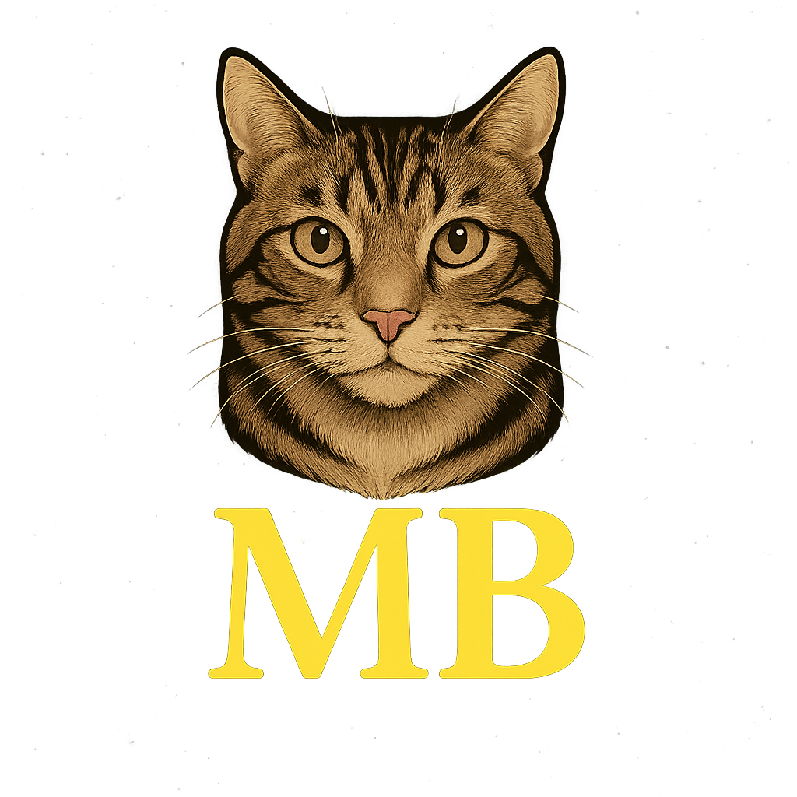
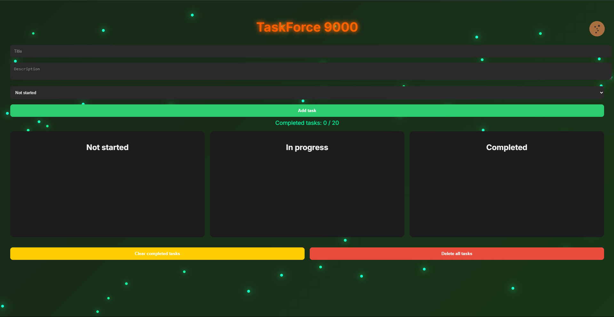

<p align="center">
  
</p>

# 🚀 TaskForce 9000 – Futuristisk gjøremålsapp med sci-fi glow

Velkommen til **TaskForce 9000** – en mørk, glødende og interaktiv gjøremålsapp bygget med React og Vite. Appen kombinerer produktivitet med stil og sci-fi-estetikk.

---

## 🌌 Hva er dette prosjektet?

Dette prosjektet er laget som en del av min frontend-læringsreise, hvor jeg ønsket å utforske React kombinert med interaktiv UI og gamification. Du kan organisere oppgaver, dra og slippe dem, og bli belønnet med konfetti og motiverende quotes!

---

## 🚀 Kom i gang

### 1. Klon prosjektet

```bash
git clone https://github.com/ditt-brukernavn/taskforce9000.git
cd taskforce9000
```

### 2. Installer avhengigheter

```bash
npm install
```

### 3. Start utviklingsserver

```bash
npm run dev
```

---

## 🛠️ Teknologier brukt

- **React 19**
- **Vite**
- **CSS Modules**
- **@hello-pangea/dnd** – dra-og-slipp
- **canvas-confetti** – konfettianimasjon
- **localStorage**
- **HTML/CSS** – og en god dose neon ✨

---

## 🗂️ Prosjektstruktur

```
taskforce9000/
├── public/             
├── src/
│   ├── components/
│   │   ├── TaskForm/
│   │   ├── TaskList/
│   │   ├── TaskColumn/
│   │   ├── TaskCard/
│   │   ├── Cookie/
│   │   └── Reward/
│   ├── styles/
│   │   ├── global.css
│   │   └── background.css
│   ├── App.jsx
│   └── main.jsx
├── index.html
├── package.json
└── vite.config.js
```

---

## 📸 Eksempel på appen

<p align="center">
  
</p>

---

## ✨ Funksjoner

- ✅ Legg til oppgaver med tittel og status
- 📦 Dra og slipp mellom kolonner
- 🎯 Status: Not started, In progress, Completed
- 💾 Automatisk lagring med localStorage
- 🎉 Belønningssystem og konfetti
- 💣 Slett alt med ett klikk
- 🍪 Interaktiv cookie med damp
- 🌌 Glow-effekter og partikkelbakgrunn

---

## 🧠 Videre utvikling

Planer for fremtiden:
- Fremdriftsindikator og visuell progressbar
- Mulighet for deadlines og sortering
- Ukesvisning og filtre
- Brukerinnlogging og backend
- Flere animasjoner og sci-fi-elementer
- Gamification og avatarer

---

## ✍️ Signatur

```
//  One bug to find them,
//  One fix to bring them all,
//  And in the darkness bind them.
```

---

## 📬 Kontakt

Har du forslag eller vil bidra? Åpne en issue eller send en pull request via GitHub!

---