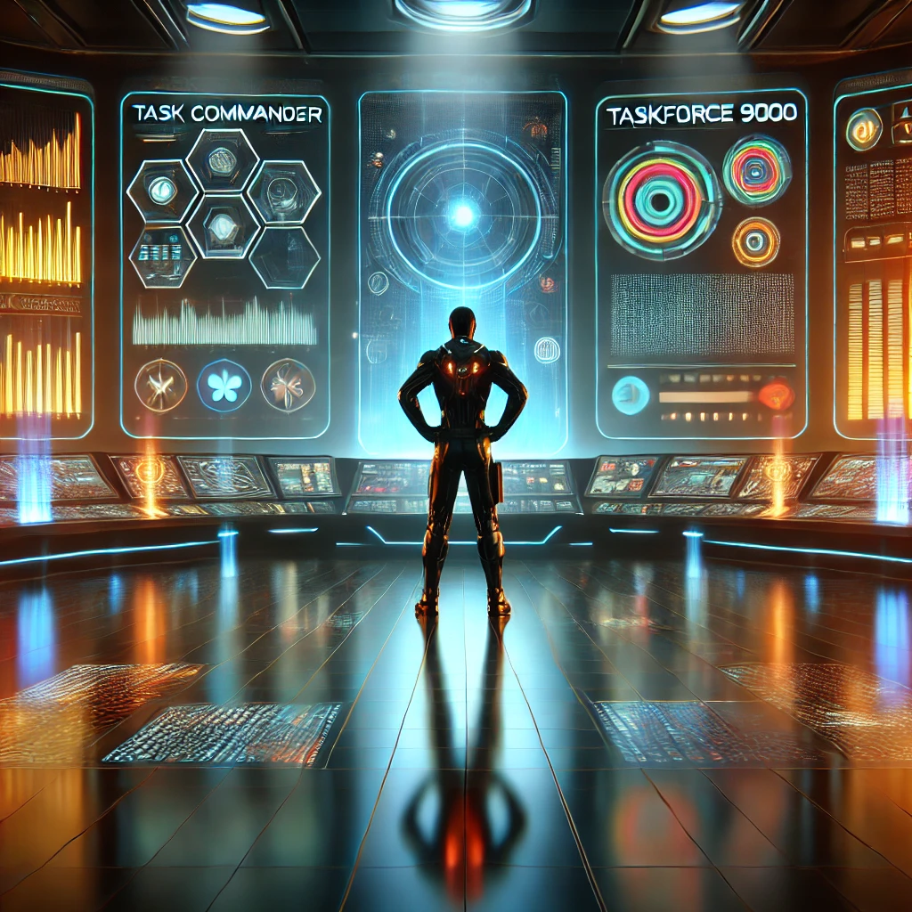

# 🚀 TaskForce 9000

**TaskForce 9000** er en futuristisk, mørk og glødende gjøremålsapp laget med React og Vite.  
Appen kombinerer funksjonell produktivitet med et stilrent, sci-fi-inspirert brukergrensesnitt.

Du kan legge til oppgaver, dra og slippe dem mellom ulike statuser, og oppleve en belønningsmekanikk når du rydder unna!

---

## 🔧 Funksjoner

- ✅ Legg til nye oppgaver med tittel, beskrivelse og status
- 📦 Tre kolonner for statuser: **Not started**, **In progress** og **Completed**
- 🎯 Dra og slipp oppgaver mellom kolonner med full støtte fra `@hello-pangea/dnd`
- 💾 Automatisk lagring i `localStorage` – husker oppgavene dine mellom økter
- 🎉 Rydd fullførte oppgaver med konfettianimasjon og belønningssystem
- 💣 Tøm alle oppgaver med ett klikk (med bekreftelse)
- 🌒 Moderne mørk design med neon-elementer og animert bakgrunn
- 🍪 Interaktiv cookie – klikkbar og dampende!
- 🌟 Belønningssystem med popup for hver 5. oppgave (opp til 20), inkludert:
  - Motiverende quote
  - Fullføringsindikator: **"Completed tasks: X / 20"**
  - Automatisk reset etter 20 oppgaver
- 🧠 Full støtte for engelskspråklig brukergrensesnitt
- ✨ Bakgrunn med animerte partikler og glow-effekt

---

## 🧪 Teknologi brukt

- ⚛️ React 19
- ⚡ Vite
- 🎨 CSS Modules
- 🧲 @hello-pangea/dnd – drag and drop
- 🎊 canvas-confetti – konfettianimasjon
- 💽 localStorage
- ✍️ HTML/CSS + en solid dose neon

---

## 🧠 Hvordan jeg har jobbet

Jeg startet med en enkel JavaScript-versjon og planla en ny versjon med React og Vite.  
Deretter satte jeg opp en god og skalerbar filstruktur og bygde komponentene:

- `TaskForm` – for å legge til oppgaver
- `TaskList` – for å vise og organisere oppgaver
- `TaskColumn` – én kolonne per status
- `TaskCard` – hvert enkelt oppgavekort

Stylingen er gjort med `global.css` for felles stil og `CSS Modules` for komponentspesifikke detaljer.

Jeg implementerte `localStorage` slik at appen husker data, og etter hvert la jeg inn dra-og-slipp med `@hello-pangea/dnd`.  
Til slutt la jeg til belønning, interaktiv cookie og en sci-fi-animasjon for å gi appen en særegen følelse.

---

## 🧱 Prosjektstruktur
src/ ├── components/ │ ├── TaskForm/ │ ├── TaskList/ │ ├── TaskColumn/ │ ├── TaskCard/ │ ├── Cookie/ │ └── Reward/ ├── styles/ │ ├── global.css │ └── background.css ├── App.jsx ├── main.jsx

---

---

## 📈 Neste steg

- 🔁 Fremdriftsindikator og visuell progressbar
- 🧠 Mulighet for å sette deadlines/dato og sortere på tid
- 🗓️ Ukesvisning eller filter for "I dag", "Denne uka", "Senere"
- 🔐 Brukerinnlogging og backend-lagring
- 🌌 Flere bakgrunnseffekter: grid, nebulas, bevegelse
- 🎮 Gamification-elementer og avatar

---

## 📸 Live Preview

  Her ser du versjon 1 av ''task-manageren'' min.

🛰️ [Se appen live her](https://marcus-kodehode.github.io/CRUDProject/)

---

## ✍️ Laget av

**Marcus @ Kodehode**  
_"Med lidenskap for mørke grensesnitt, glow-effekter og produktivitet med stil."_

// 💍 One bug to find them,
// 🔥 One fix to bring them all,
// 💡 And in the darkness bind them.

---

## 📄 Lisens

Dette prosjektet er laget for læring og kreativ utfoldelse.  
Bruk gjerne koden, remix den, og gjør den til din egen!

> 
